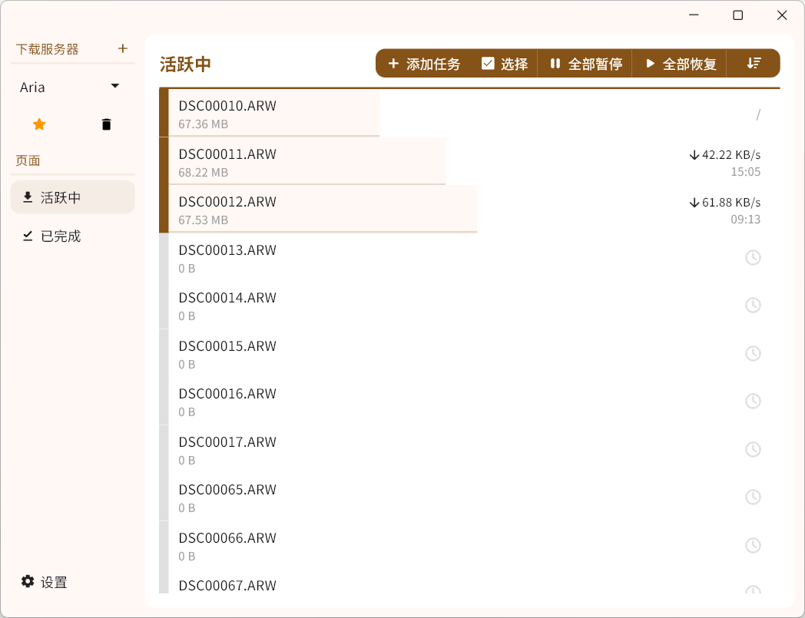
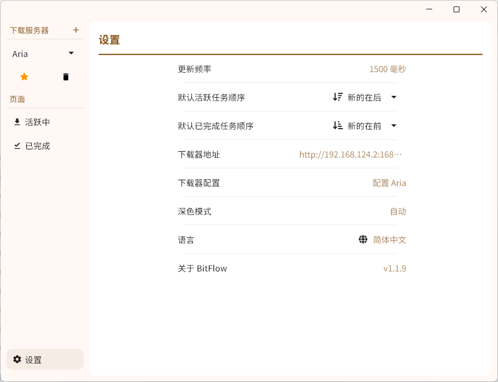
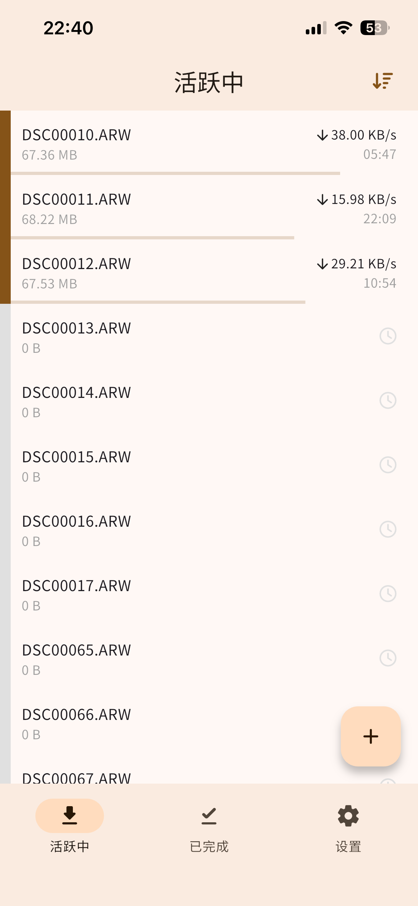

# BitFlow

Also available in English. Click [HERE](/documents/en.md) to view the English version of the README

## 简介

这是一个支持多下载器的桌面端远程控制App，支持Windows，macOS，iOS（需要自行打包）和Android

✅ qBittorrent  
✅ Aria

## 目录

- [简介](#简介)
- [截图](#截图)
  - [桌面端](#桌面端)
  - [移动端](#移动端)
- [在你的设备上构建](#在你的设备上构建)

## 截图

## 桌面端

## 移动端

## 在你的设备上构建

- 安装Flutter，安装步骤见[Flutter - Quick start](https://docs.flutter.cn/get-started/quick)，本项目使用的Flutter版本为`3.41`
- 如果你需要在Android设备上运行或者调试，需要安装Android Studio
  - 开发使用的Android SDK版本: `35.0.1`
  - 指定NDK版本: `27.2.12479018`
- 如果你需要在iOS设备上运行或者调试，需要使用Mac，并且安装Xcode*
  - Minimum Deployment Target: `iOS 12.0`
- 对于Windows和macOS，直接运行即可
- 建议使用Visual Studio Code打开项目
  - 在Visual Studio Code的右下角找到`Device`按钮（也有可能显示为可用的设备），选择目标设备或者模拟器
  - 在`运行和调试`面板选择`Debug`，`Profile`或者`Release`**，详细的区别见[Flutter官网](https://docs.flutter.dev/testing/build-modes)

***注意**，你需要通过Xcode（使用Xcode打开文件`ios/Runner.xcworkspace`可以自动获取）获取证书，非开发者账户的证书的有效期为一个星期，也就是说一个星期之后你需要重新打开Xcode获取证书

****注意**，模拟器无法使用`Release`模式，实体iPhone无法使用`Debug`模式