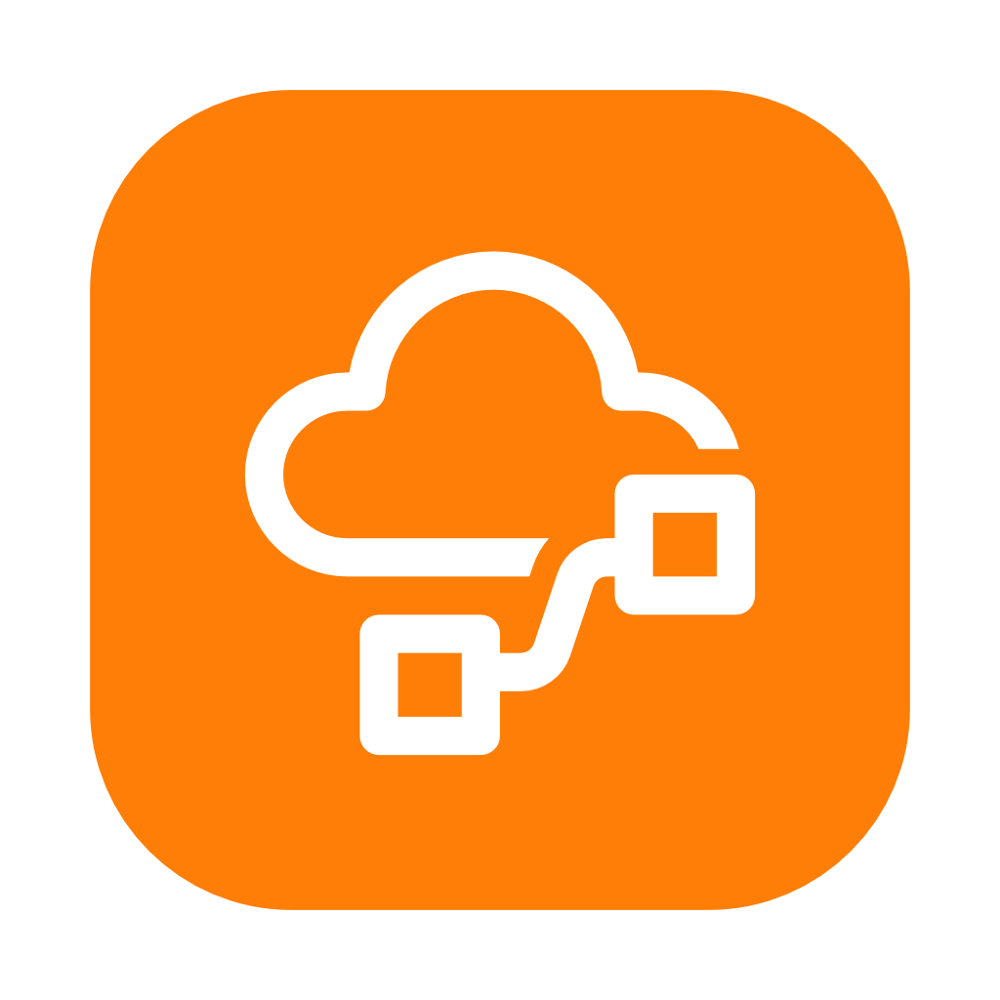
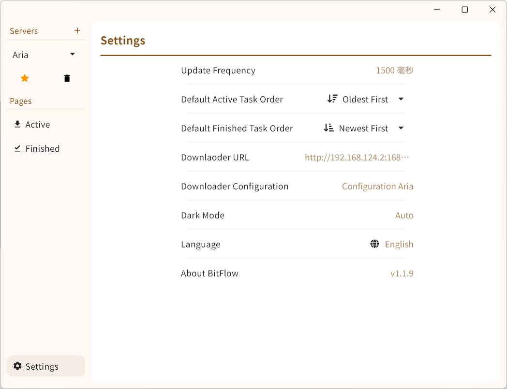
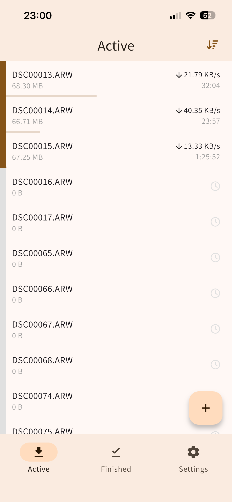

# BitFlow

## Intro

This is a desktop remote control app that supports multiple downloaders.  
It supports Windows, macOS, iOS (requires manual packaging), and Android.

✅ qBittorrent  
✅ Aria

## Contents
- [Intro](#intro)
- [Screenshots](#screenshots)
  - [Desktop](#desktop)
  - [Mobile](#mobile)
- [Build on Your Device](#build-on-your-device)

## Screenshots

## Desktop

## Mobile

## Build on Your Device

- Install Flutter. For installation steps, see [Flutter - Quick start](https://docs.flutter.cn/get-started/quick).  
- If you need to run or debug on an Android device, you must install Android Studio.
  - Android SDK version used for development: `35.0.1`
  - Required NDK version: `27.2.12479018`
- If you need to run or debug on an iOS device, you must use a Mac and install Xcode*.
  - Minimum Deployment Target: `iOS 12.0`
  The Flutter version used in this project is `3.38`.
- For Windows and macOS, you can run the project directly.
- It is recommended to open the project using Visual Studio Code.
  - In the bottom-right corner of Visual Studio Code, find the `Device` button (it may also display available devices), and select the target device or emulator.
  - In the **Run and Debug** panel, choose `Debug`, `Profile`, or `Release`**.  
    For detailed differences between these modes, see the [Flutter official documentation](https://docs.flutter.dev/testing/build-modes).

* **Note:** You need to obtain certificates through Xcode (they can be fetched automatically by opening the file `ios/Runner.xcworkspace` in Xcode).  
Certificates for non-developer accounts are valid for one week, which means you need to reopen Xcode to obtain a new certificate after one week.

** **Note:** Simulators cannot use `Release` mode, and physical iPhones cannot use `Debug` mode.